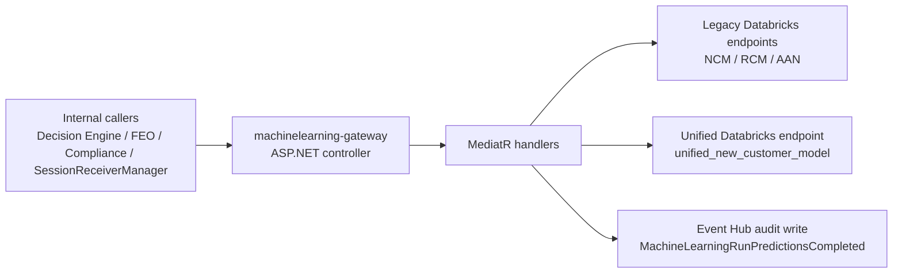
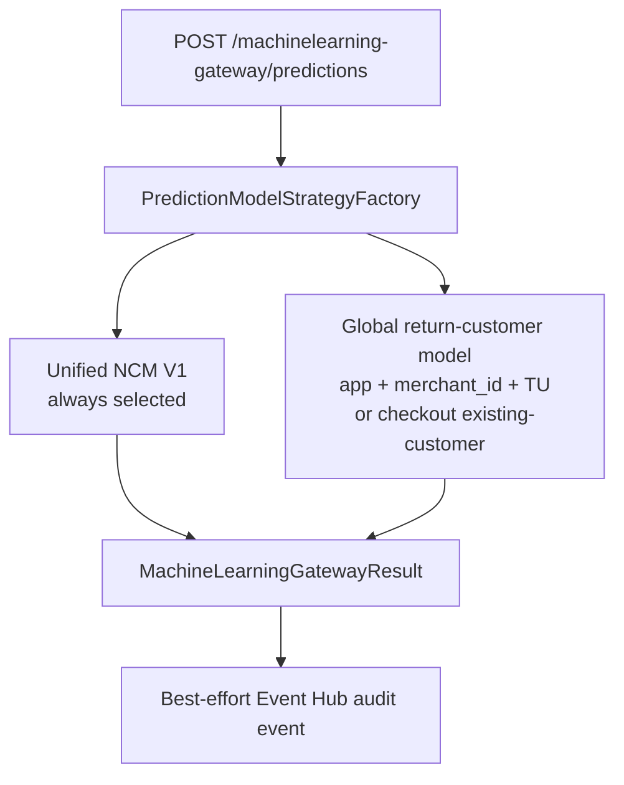

# Machine Learning Gateway Overview

- Service or system: `provider-gateways / machine-learning-gateway`
- Repo path: `services/provider-gateways/src/QuadPay.ProviderGateways.MachineLearning`
- Exact scope: HTTP API surface, live `RunPredictions` behavior, outbound model dependencies, audit-event path, and production runtime footprint as observed on `2026-04-08`
- Audience: engineers and operators who need the architectural shape before debugging, extending, or publishing fuller documentation
- Last reviewed: `2026-04-08`
- Primary conclusion: this service is an internal-only ASP.NET gateway for ML prediction and reason-code endpoints. In production, the dominant path is `POST /machinelearning-gateway/global/return-customer/prediction`, while `POST /machinelearning-gateway/predictions` is the only currently observed source of `500` responses in the last 24 hours and can also return `200 OK` with failed or partially succeeded model-attempt results.

# What This Service Does

- Primary responsibility:
  - expose internal prediction and reason-code endpoints for checkout, app-signup, and return-customer flows
  - normalize request payloads and route them to legacy Databricks serving endpoints or the newer unified new-customer model endpoint
  - aggregate concurrent model attempts for `POST /machinelearning-gateway/predictions` and publish a best-effort audit and BI event
- Important boundaries:
  - this service does not train models
  - it does not own underwriting or customer-lifecycle decisions
  - it does not persist customer state or model outputs in a local database
- What this service explicitly does not own:
  - caller orchestration in Decision Engine, Front End Orchestration, Compliance, or messaging workers
  - Databricks endpoint lifecycle and model versioning
  - Event Hubs downstream consumption

# Runtime Shape

- Deployables or applications:
  - ASP.NET application `QuadPay.ProviderGateways.MachineLearning`
  - Helm/Kubernetes service name `machinelearning-gateway`
  - Azure pipeline `services/provider-gateways/azure-pipelines-machinelearning-gateway.yml`
- Ingress types:
  - internal JWT-protected HTTP controller routes under `/machinelearning-gateway`
  - health endpoint at `/machinelearning-gateway/healthz`
  - production Helm values disable ingress, while development Helm values enable it
- Data stores:
  - no direct database, cache, or storage client was found in the service code
  - request payloads carry provider blob-path references that are forwarded to downstream model services
- Major outbound dependencies:
  - unified Databricks endpoint `/unified_new_customer_model/invocations`
  - legacy Databricks serving endpoints such as `/NCM_Checkout_TU_prediction_{env}/invocations`, `/NCM_App_TU_prediction_{env}/invocations`, and `/Global_RCM_prediction_{env}/invocations`
  - `EventHubDecisionEngine` audit writer for `MachineLearningRunPredictionsCompleted`
  - Optimizely-backed feature-flag manager
  - Zip Observability and DogStatsD telemetry
- Ownership or on-call notes:
  - this microservice lives under the broader `provider-gateways` service definition
  - the current service-definition link points at the broader Confluence page `Credit Bureau Gateways`

# Main Flows

- Primary user or request flow:
  - an internal caller hits a controller route
  - the controller forwards to a MediatR command or query
  - the handler builds a request for a legacy or unified Databricks endpoint
  - the handler returns a gateway-specific response DTO
- Primary async or event-driven flow:
  - `POST /machinelearning-gateway/predictions` chooses one or more models based on `channel`, `customer_type`, `merchant_id`, and provider blob-path keys
  - the live implementation always selects `UnifiedNCMV1PredictionModel` and also selects `GlobalReturnCustomerPredictionModel` for app-with-merchant-and-TransUnion or checkout-existing-customer request shapes
  - selected models run concurrently via `ConcurrentFanoutExecutor`
  - the gateway aggregates model attempts into one result
  - the service emits `MachineLearningRunPredictionsCompleted` to Event Hubs as a best-effort side effect that does not fail the API response
- Important background or batch flow:
  - none found; the service is request-driven
- Mermaid diagrams or flow visuals:

# Dependency Model

- Upstream callers or producers:
  - production Smartscape callers currently include `QuadPay.FrontEndOrchestration`, `QuadPay.DecisionEngine`, `decision-engine-primary`, `compliance-primary`, and multiple `SessionReceiverManager` services
- Downstream services or providers:
  - Databricks serving endpoints for prediction and reason-code generation
  - Event Hubs audit-log writer
  - internal JWT issuer and audience configuration
  - Decision Engine and Compliance consumers that interpret result payloads or downstream reason-code data
- Shared platforms or infrastructure:
  - AKS runtime with production workload `machinelearning-gateway-primary` in namespace `api` on cluster `eastus-production`
  - Key Vault file mount and `DOTNET_` environment variable configuration
  - Dynatrace APM and DogStatsD
- Dependency caveats:
  - Databricks does not appear as a first-class Smartscape service in the evidence gathered here; its role is proved directly from code
  - naming is inconsistent across surfaces:
    - service-definition microservice name: `machine-learning-gateway`
    - HTTP base path and pipeline/helm service name: `machinelearning-gateway`

# Key Data And Contracts

- Most important domain entities:
  - prediction request DTOs for checkout, app-signup, and return-customer flows
  - `RunPredictions.Command` with `customerId`, `providerBlobPaths`, and `additionalFeatures`
  - `ModelCallAttempt` and aggregated `MachineLearningGatewayResult`
  - `MachineLearningModelRecord` and `ModelInformation`
- Most important external contracts:
  - legacy Databricks REST contracts in `MachineLearningEngineering/DataBricks/Clients/IMachineLearningEngineeringDataBricksClient.cs`
  - unified model REST contracts in `MachineLearningEngineering/DataBricks/Clients/IUnifiedMachineLearningClient.cs`
  - Event Hub audit event `MachineLearningRunPredictionsCompleted`
  - `RunPredictions` response semantics used by Decision Engine and related orchestration flows
- Where to look for exact schemas or inventories:
  - controller routes: `MachineLearningEngineering/Gateway/Controllers/MachineLearningController.cs`
  - handler payloads: `MachineLearningEngineering/Gateway/Commands/*.cs` and `MachineLearningEngineering/Queries/*.cs`
  - fan-out selection rules: `MachineLearningEngineering/Gateway/Commands/RunPredictionsCommandExtensions.cs`
  - provider blob-path normalization: `MachineLearningEngineering/Gateway/Factories/UnifiedDatabricksRequestFactory.cs`
  - response aggregation and status mapping: `MachineLearningEngineering/Gateway/Factories/MachineLearningGatewayResultFactory.cs`

# Operational Shape

- Important SLOs or user-visible expectations:
  - service-definition target availability: `99.9`
  - service-definition target performance: `99.0`
  - default response-time threshold: `300ms`
  - `/healthz` override: `10ms`
- Most important telemetry surfaces:
  - Dynatrace production service entity `SERVICE-F4F7F2376D687A69`
  - Dynatrace production process group `PROCESS_GROUP-D5E2EC6E18D78A77`
  - top production endpoint volumes over the last 24 hours ending about `2026-04-08 13:00 UTC`:
    - `POST global/return-customer/prediction`: `671,751` requests, `0` failures, average response time about `44.36ms`
    - `POST predictions`: `76,043` requests, `11` failures, average response time about `128.23ms`
    - `POST checkout/new-customer/transunion/prediction`: `56,606` requests, `0` failures, average response time about `80.11ms`
- Most common failure modes at a high level:
  - `POST /machinelearning-gateway/predictions` fan-out path returning `500`
  - `POST /machinelearning-gateway/predictions` returning `200 OK` with top-level `Failed` or `PartiallySucceeded`
  - downstream Databricks latency or request-build failure impacting prediction routes
  - Event Hub audit publication failure after otherwise successful fan-out completion

# Caveats

- Known ambiguity:
  - Smartscape showed two active service entities for the same logical service name; telemetry correlation indicates `SERVICE-F4F7F2376D687A69` is production and `SERVICE-40FFDB56A531E988` is development
  - Dynatrace response-time metrics were interpreted as microseconds based on Davis CoPilot guidance, so `44,358.7` was treated as `44.36ms`
- Partial coverage:
  - this pass did not inspect downstream caller codebases
  - supporting Confluence pages were used only as secondary context; current-state claims prefer the inspected code and the `Run Predictions` page updated on `2026-03-18`
- Out-of-scope areas:
  - model-quality evaluation
  - Databricks-side implementation details
  - cross-service business process documentation beyond the gateway boundary

# Related Docs

- Reference page: `./service-reference.md`
- Operability guide: `./operability-guide.md`
- Tutorial:
  - none yet
