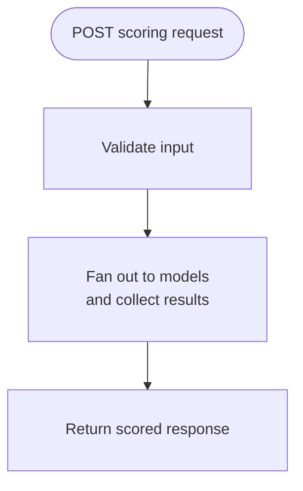
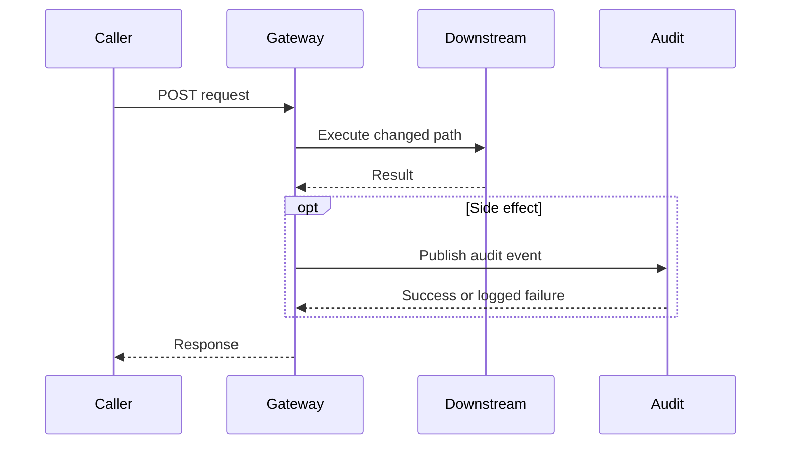

# PR Diagram

Turn a GitHub pull request or local diff into a concise description with a focused Mermaid flowchart or sequence diagram that explains the changed execution path, interaction order, rollout shape, or integration flow. Use this when reviewers need a fast mental model of what changed without reading a changelog.

## Inputs

Accept any of:

- a PR number
- a GitHub PR URL
- a local branch or diff when the user wants a draft before or without opening a PR

Optional inputs:

- whether to update the live PR body or keep the result in session only
- whether to preserve existing issue links, checklists, generated summaries, or rollout notes
- whether to include a verification section
- whether the user specifically wants a flowchart, a sequence diagram, or the best fit chosen automatically

## Defaults

Default to `session-only draft`.

- do not mutate a PR body unless the user explicitly asks
- preserve existing issue links, checklists, and automation blocks when editing an existing PR
- use one Mermaid diagram unless the change genuinely has two disjoint flows that both matter
- choose one diagram type deliberately; do not include both a flowchart and sequence diagram by default
- keep the summary short: usually 2 to 3 sentences or 2 short paragraphs
- if the diff has no meaningful code-path change, say so instead of forcing a diagram

## Workflow

1. Identify the source artifact.
- Read the PR title, body, base branch, head branch, changed files, and enough of the current description to see what should be preserved.
- If no PR exists, inspect the local diff against the intended base branch.
- Decide whether the user wants a fresh description, a rewrite of the top section only, or a full-body update.

2. Build the changed-flow model.
- Inspect the diff and adjacent code until you can describe the main changed path in plain language.
- If the scope is unclear, read the linked Jira story and relevant design doc, or follow the context-gathering pattern in `../workflows/review-pr.md`.
- Reduce the change to the essential path:
  - entry point
  - important branching, retries, fanout, persistence, or notifications
  - changed outputs, emitted telemetry, or downstream effects
- Exclude unchanged plumbing and helper detail.

3. Decide the diagram type and shape.
- Use `flowchart TD` when the main job is to show branching, retries, aggregation, persistence, or a changed execution path.
- Use `sequenceDiagram` when the reviewer mainly needs ordered interactions between actors such as caller, gateway, handler, downstream service, and side-effect systems.
- Prefer 4 to 8 nodes for flowcharts.
- Prefer 3 to 7 actors for sequence diagrams.
- Draw one node or actor per meaningful runtime step or system role, not one per class or method.
- Show fanout, retry, persistence, metrics, alerts, or external systems only when the PR changes that behavior or when the reviewer would misunderstand the change without them.
- Do not diagram the whole service when the PR only touches one path.

4. Write the summary.
- Start with a short description of what changed and why the change matters.
- Keep the opening reviewer-oriented, not implementation-inventory-oriented.
- Mention rollout or compatibility posture only when it affects review judgment.

5. Compose the final body.
- Put the short summary first.
- Add one Mermaid diagram immediately after the summary.
- Add a short verification section when tests, local validation, or rollout caveats matter.
- Preserve or reattach existing sections that should survive the rewrite:
  - issue links
  - checklists
  - generated summary blocks such as `<!-- CURSOR_SUMMARY -->`
  - rollout or dependency notes

6. Apply the update when requested.
- Draft the body in session first when the user wants review before mutation.
- When the user explicitly asks to update the PR, write the body to a temp file and use `gh pr edit ... --body-file`.
- Re-read the final PR body after mutation when the change is important or the body was heavily restructured.

## Mermaid Rules

- Use a fenced `mermaid` code block.
- Keep labels short and concrete.
- Do not invent systems, branches, actors, or steps that the code or PR description does not support.
- Keep the diagram focused on the changed path, not the whole architecture.
- The init directive, label-length guidance, and color rules below apply to `flowchart` diagrams only. For `sequenceDiagram`, omit the init directive and `classDef` styling.

For flowcharts:

- Prefer simple linear or lightly branching graphs over dense subgraphs.
- Add this init directive as the first line of every flowchart to reduce GitHub text clipping:

```text
%%{init: {'flowchart': {'padding': 30}} }%%
```

- Keep labels concise even with the init directive:
  - max about 35 characters per line for rectangular nodes such as `["text"]` and `[["text"]]`
  - max about 25 characters per line for stadium nodes such as `(["text"])`
  - shorten URLs and long identifiers
  - split longer labels with `<br/>`
- Use exact dark-mode-safe classes when highlighting changed logic:

```text
classDef added fill:#1a7f37,stroke:#3fb950,color:#ffffff
classDef modified fill:#7d5800,stroke:#d29922,color:#ffffff
```

- Use `added` for wholly new logic and `modified` for existing logic changed by the PR.

For sequence diagrams:

- Declare actors explicitly with `participant`.
- Use `par`, `alt`, `opt`, and `loop` only when they clarify the changed behavior.
- Keep messages short and runtime-oriented.
- Avoid one message per helper method; group work into reviewer-meaningful interactions.

Example:



Sequence example:



## Command Patterns

Prefer these GitHub queries:

- `gh pr view <number> --json title,body,baseRefName,headRefName,files,url`
- `gh pr diff <number> --repo <owner>/<repo>`
- `gh pr edit <number> --repo <owner>/<repo> --body-file <file>`

Prefer these local checks:

- `git diff origin/<base>...HEAD -- <path>`
- `rg` for locating the runtime entry point and adjacent code paths
- narrow local tests only when they help verify claims included in the PR description

Prefer these context reads when needed:

- `searchAtlassian` to resolve a Jira story or Confluence page from the PR body
- `getJiraIssue` for acceptance criteria or rollout notes that materially change the diagram or summary
- `getConfluencePage` for directly linked design docs

## Output Rules

- Keep the description truthful, compact, and reviewer-oriented.
- Preserve exact issue keys, PR numbers, branch names, and dates when they matter.
- Do not let the diagram become a changelog, class inventory, or full system architecture map.
- If the code supports multiple plausible diagrams, choose the one that best explains the review-critical flow and state any important omission in prose.
- If evidence is too thin to confidently describe the flow, say so and keep assumptions explicit instead of guessing.
- When using flowchart classes, use this exact legend wording: `**Green** = new logic added by this PR. **Amber** = existing logic modified by this PR. Unstyled nodes = unchanged context.`
